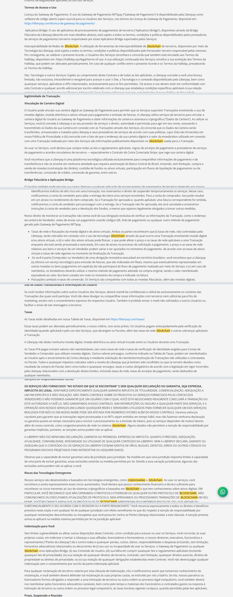

# Auditoria de Palavras Restritas em Site (Meta Ads Compliance)

Pipeline em Python que varre um site, encontra palavras que violam políticas de anúncios (ex.: termos relacionados a criptomoedas/web3) e gera evidência visual + um PDF pronto para apresentar à gestão ou usar em recurso de bloqueio de conta de anúncios.

## Contexto

Uma conta de anúncios no Meta Ads foi bloqueada porque o site institucional continha palavras associadas a criptomoedas/web3, o que viola as políticas de anúncios da plataforma. Para embasar a revisão da conta, era preciso um relatório objetivo mostrando **exatamente onde** cada termo aparecia — não bastava listar URLs, era preciso prova visual de cada ocorrência.

Esse projeto automatiza esse trabalho, que manualmente seria abrir dezenas de páginas, ler o conteúdo, printar e organizar tudo à mão.

## Como funciona

O pipeline é dividido em 4 etapas independentes, cada uma lendo o resultado da anterior:

```
1. analiseseo.py            2. gerar_relatorio_html.py   3. capturar_prints.py         4. gerar_pdf_evidencias.py
   crawler + regex     -->      relatório visual HTML  -->   screenshots destacados  -->   PDF final de evidências
   gera CSV                     (conferência rápida)         (Playwright)                  (ReportLab)
```

**1. `analiseseo.py`** — Lê o `sitemap.xml` do site (ou faz um crawler simples pelos links internos, se não achar sitemap). Para cada página, baixa o HTML e procura as palavras-chave configuradas usando regex de palavra inteira (`\b...\b`, case-insensitive), evitando falso-positivo dentro de outras palavras. Gera `relatorio_varredura.csv` com URL, palavra encontrada e um trecho de contexto.

**2. `gerar_relatorio_html.py`** — Transforma o CSV num relatório HTML navegável, agrupado por página, com a palavra destacada no texto e contadores por palavra-chave — útil para conferir os resultados rapidamente antes de gerar as evidências "pesadas".

**3. `capturar_prints.py`** — Abre cada página com ocorrência num navegador automatizado (Playwright), injeta JavaScript para envolver a palavra encontrada num `<mark>` (destaque amarelo) e tira o print. Em vez de printar a página inteira — o que fica ilegível em páginas longas —, o script localiza a posição de cada ocorrência, agrupa ocorrências próximas numa seção só e recorta **apenas os trechos relevantes**, empilhando-os num único print por página.

**4. `gerar_pdf_evidencias.py`** — Junta tudo num PDF final: capa com resumo por palavra-chave, e um bloco por página com link clicável, o(s) print(s) e uma tabela com a palavra + trecho de texto correspondente.

## Exemplos de saída

Página com múltiplas seções onde a palavra aparece em pontos diferentes (nav, hero, blocos de conteúdo) — cada ocorrência vira um recorte, empilhados num só print:


Página de texto longo (Termos de Uso) — em vez do print da página inteira (ilegível quando espremida num PDF), só as seções com a palavra destacada:



## Destaques técnicos

- **Detecção por regex de palavra inteira**, evitando falsos positivos (ex.: não confundir "cripto" dentro de outra palavra).
- **Injeção de DOM via JavaScript** para destacar o termo encontrado sem alterar o layout da página, com tratamento especial para não quebrar títulos com efeito de texto em gradiente (`background-clip: text`).
- **Recorte inteligente por seção**: em vez de printar a página inteira, o script agrupa ocorrências próximas e recorta só os trechos relevantes — reduzindo o tamanho do PDF final e mantendo o texto legível.
- **Correção de uma condição de corrida real**: a home do site tem um título com efeito de texto animado. Medir a posição do elemento e só depois tirar o print deixava uma janela de tempo em que a posição podia mudar, quebrando o recorte. A solução foi remedir a posição bem em cima da hora do print (não uma vez só no início) e, se ainda assim falhar, cair automaticamente para o print da página inteira como plano B — garantindo que nenhuma página fica sem evidência.
- **Coordenadas relativas ao viewport**: o recorte de screenshot do Playwright (`clip`) só funciona com coordenadas do que já está visível na tela, não do documento inteiro — o script rola a página até cada seção antes de medir e printar.
- **Geração de PDF com quebra de linha correta**: uso de `Paragraph` do ReportLab nas células da tabela em vez de texto solto, evitando que trechos longos estourem para fora da página.

## Stack

- **Python 3**
- **Requests + BeautifulSoup** — parsing de sitemap.xml e extração de texto de HTML
- **Playwright** (Chromium) — automação de navegador, injeção de JS, screenshots
- **Pillow (PIL)** — composição de imagens (empilhar recortes de seção num só print)
- **ReportLab** — geração do PDF final

## Como rodar

```bash
python -m pip install requests beautifulsoup4 playwright pillow reportlab
playwright install chromium
```

Ajuste `BASE_URL` e `KEYWORDS` no topo de `analiseseo.py`, depois rode os 4 scripts **nessa ordem**:

```bash
python analiseseo.py
python gerar_relatorio_html.py
python capturar_prints.py
python gerar_pdf_evidencias.py
```

O resultado final é o arquivo `evidencias_varredura.pdf`.

## Estrutura do projeto

```
analiseseo.py              # 1. varredura de palavras-chave (crawler + regex)
gerar_relatorio_html.py    # 2. relatório visual em HTML
capturar_prints.py         # 3. captura de evidência com Playwright
gerar_pdf_evidencias.py    # 4. montagem do PDF final
docs/exemplos/             # imagens de exemplo usadas neste README
```

> Os arquivos gerados pelo pipeline (`relatorio_varredura.csv`, `relatorio_visual.html`, `evidencias_varredura.pdf`, `prints_evidencia/`) não fazem parte do repositório — são saída de cada execução, não código-fonte, e contêm dados específicos da varredura de um site real.
